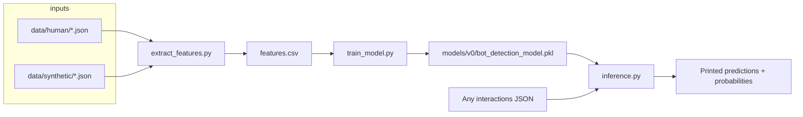
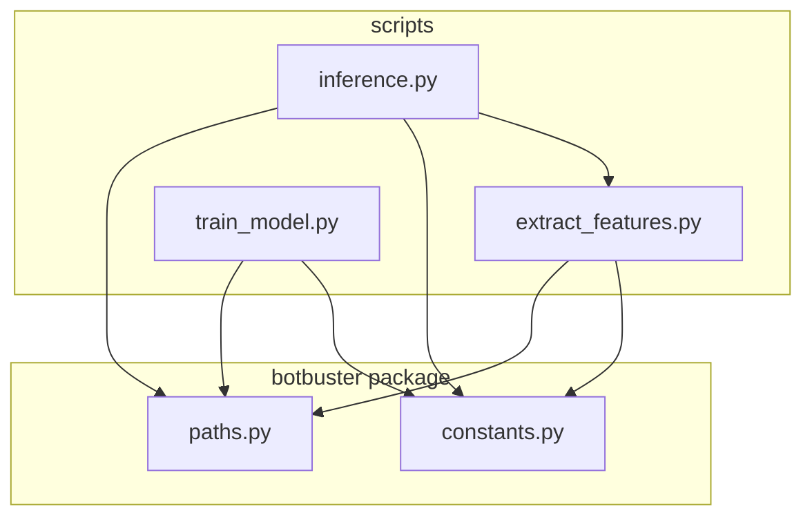
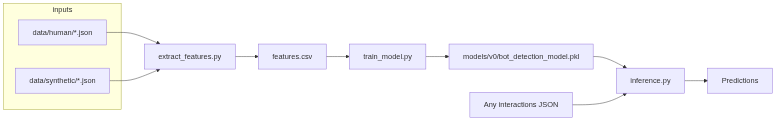
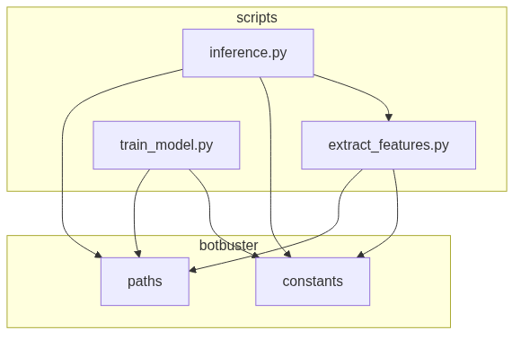

# Botbuster architecture

This document describes how the training and inference pieces fit together and how the small `botbuster` package shares configuration.

## End-to-end pipeline

1. **Feature extraction** walks human and synthetic directories, parses each JSON session, computes behavioral statistics, and writes one CSV row per session with metadata columns and a `label`.
2. **Training** reads the CSV, drops metadata columns, fits a `GradientBoostingClassifier`, and serializes the estimator with joblib.
3. **Inference** reloads the model, reads the **column order** from the same CSV header the model was trained on (so feature order stays consistent), extracts features from the input JSON via the same code path as training data, and emits per-session predictions.

## Module and dependency graph

- **`botbuster.paths`**: Resolves the repository root and default locations for data, `features.csv`, and the default model path. Scripts accept CLI overrides so paths stay portable across machines.
- **`botbuster.constants`**: Single source for label integers (`LABEL_BOT`, `LABEL_HUMAN`) and metadata column names excluded from the model matrix.
- **`inference.py`** imports **`process_json_file`** from **`extract_features.py`** so training and scoring always use the same feature definitions.

## Feature surface

Detailed semantics for each engineered column are documented in [FEATURES.md](../FEATURES.md) at the repository root.

## Raster diagrams (generated)

The following images are produced by [generate_graphs.sh](generate_graphs.sh) from the Mermaid sources in [diagrams/](diagrams/):

